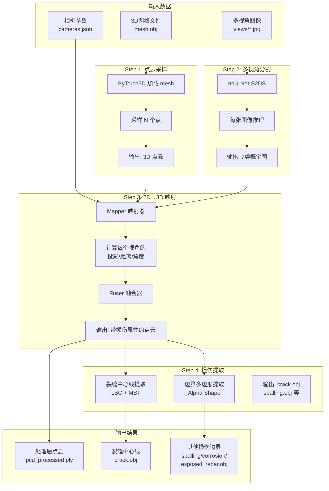

# ENSTRECT 3D 损伤建模计划

## 功能概述

ENSTRECT 的核心功能就是：**将多视角图像中的 2D 损伤分割结果，映射到 3D 点云/网格模型上**，从而获得结构损伤的精确空间位置。

---

## 完整工作流程



---

## 使用方法

### 方法 1: 命令行运行

```bash
# 激活 stereo 环境
conda activate stereo

# 进入 ENSTRECT 目录
cd G:\Zed\ENSTRECTtest\enstrect

# 运行完整 pipeline（使用 Bridge B 测试数据 - 需要先下载数据）
python -m enstrect.run \
    --obj_or_ply_path src/enstrect/assets/segments/bridge_b/segment_test/mesh/mesh.obj \
    --images_dir src/enstrect/assets/segments/bridge_b/segment_test/views \
    --cameras_path src/enstrect/assets/segments/bridge_b/segment_test/cameras.json \
    --out_dir src/enstrect/assets/segments/bridge_b/segment_test/out \
    --scale 0.25 \
    --num_points 1000000
```

### 方法 2: Python API

```python
import sys
sys.path.insert(0, r'G:\Zed\ENSTRECTtest\enstrect\src')

from pathlib import Path
from enstrect.run import run

run(
    obj_or_ply_path=Path("path/to/mesh.obj"),
    cameras_path=Path("path/to/cameras.json"),
    images_dir=Path("path/to/views"),
    out_dir=Path("path/to/output"),
    select_views=None,      # 使用所有视角
    num_points=10**6,       # 采样100万点
    scale=0.25              # 0.25=快速测试, 1.0=高精度
)
```

---

## 参数说明

| 参数 | 类型 | 默认值 | 说明 |
|------|------|--------|------|
| `--obj_or_ply_path` | Path | (必须) | 3D模型路径 (.obj 或 .ply) |
| `--cameras_path` | Path | (必须) | 相机参数文件 (cameras.json) |
| `--images_dir` | Path | (必须) | 多视角图像目录 |
| `--out_dir` | Path | (必须) | 输出目录 |
| `--scale` | float | 0.25 | 图像缩放比例 (0.25快, 1.0精) |
| `--num_points` | int | 1,000,000 | 点云采样点数 |
| `--select_views` | list | None | 指定使用的视角 (None=全部) |

---

## 输入数据格式

### cameras.json 格式

```json
{
  "0000": {
    "focal_length": [[11568.55, 11568.55]],
    "principal_point": [[3746.27, 2372.46]],
    "image_size": [[4912.0, 7360.0]],
    "R": [[[-0.819, -0.027, -0.572], ...]],
    "T": [[0.500, 0.771, 3.775]],
    "in_ndc": false
  },
  "0001": { ... }
}
```

- `focal_length`: 焦距 [fx, fy]
- `principal_point`: 主点 [cx, cy]
- `image_size`: 图像尺寸 [height, width]
- `R`: 3x3 旋转矩阵
- `T`: 1x3 平移向量
- `in_ndc`: 是否在 NDC 坐标系

---

## 输出文件

| 文件 | 格式 | 内容 |
|------|------|------|
| `pcd_{N}_processed.ply` | .ply | 带损伤类别属性的点云 |
| `crack.obj` | .obj | 裂缝中心线骨架 |
| `spalling.obj` | .obj | 剥落区域边界 |
| `corrosion.obj` | .obj | 腐蚀区域边界 |
| `exposed_rebar.obj` | .obj | 外露钢筋边界 |

---

## 数据准备建议

### 如果使用自己的数据

1. **3D 模型**: 确保单位是**米** (ENSTRECT 内部使用米制)
2. **相机参数**: 需要从 COLMAP、Metashape 等工具导出为 PyTorch3D 格式
3. **图像命名**: 建议与 cameras.json 中的键名对应 (如 0000.jpg)

### 推荐软件导出相机参数

- **Metashape** (商业软件)
- **COLMAP** (开源)
- **Meshroom** (开源)

---

## 当前状态

| 组件 | 状态 | 说明 |
|------|------|------|
| ENSTRECT 安装 | ✅ | stereo 环境中已安装 |
| nnU-Net-S2DS | ✅ | 单图分割测试通过 |
| PyTorch3D | ⚠️ | 未安装（需要编译） |
| 测试数据 | ❌ | 需要下载 Google Drive 数据 |

---

## 待完成任务

1. **安装 PyTorch3D** - Windows 上安装较复杂
2. **下载测试数据** - 需要科学上网访问 Google Drive
3. **运行完整 3D 映射 pipeline** - 验证整个流程

---

## 备选方案

如果 PyTorch3D 安装困难，可以：

1. **使用预处理的点云 (.ply)** - 跳过 mesh 加载步骤
2. **手动准备 cameras.json** - 根据项目提供的格式
3. **分离测试各模块** - 先测试 Mapper 和 Fuser 的功能
