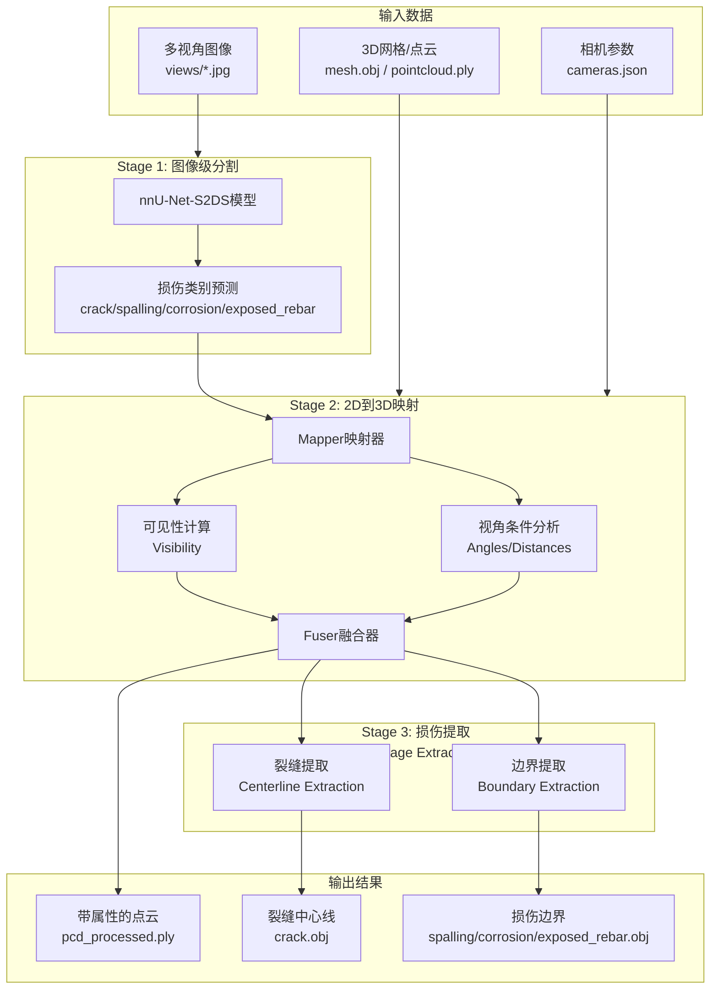
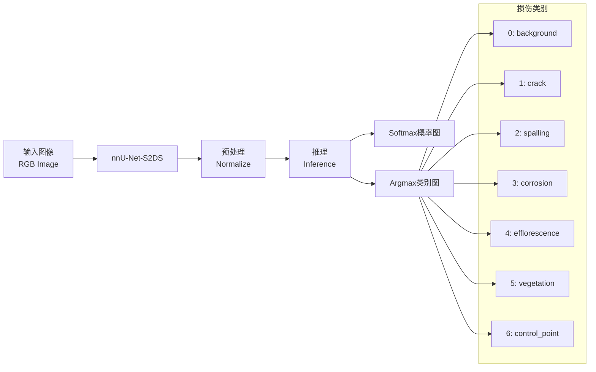
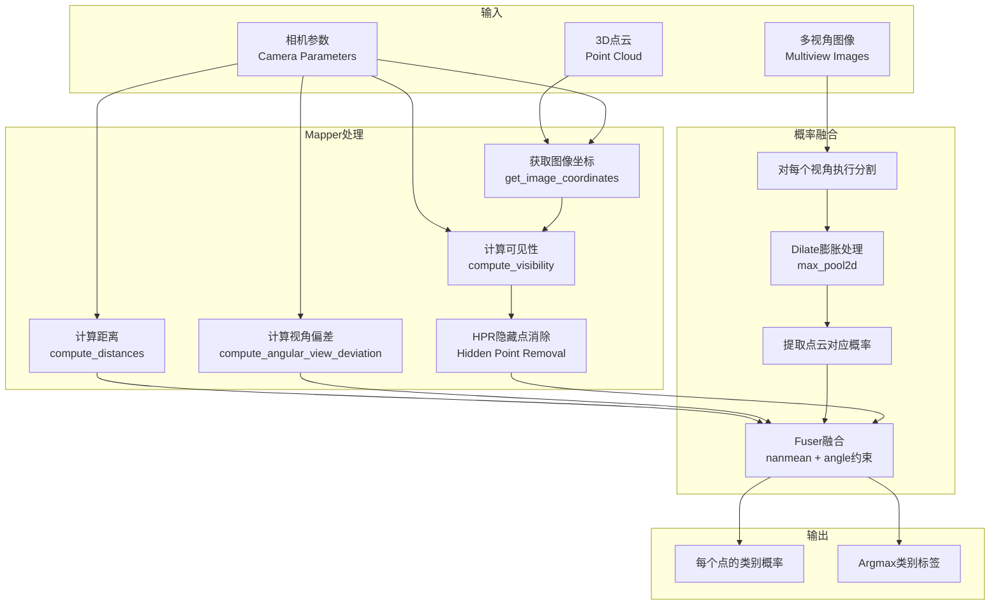
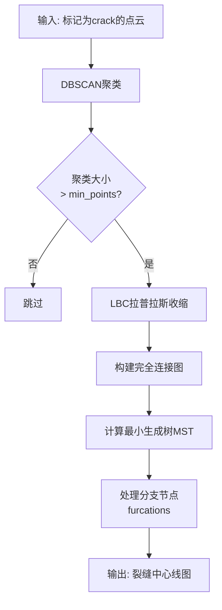
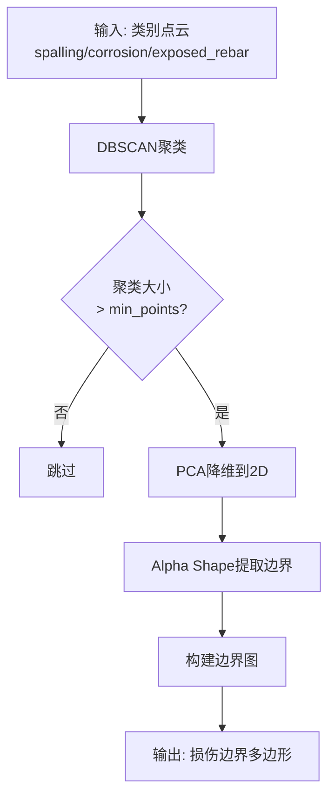
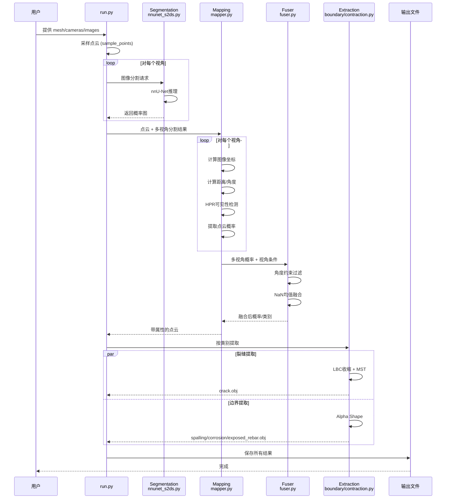

# ENSTRECT 工作流程详解

> **ENSTRECT** (Enhanced Structural Inspection) - 基于图像的结构损伤检测与提取系统

## 概述

ENSTRECT 是一个三阶段流水线（Three-Stage Pipeline），用于从多视角图像中检测和提取结构损伤（裂缝、剥落、腐蚀、外露钢筋等），并将 2D 分割结果映射到 3D 点云空间。

---

## 整体架构



---

## 详细工作流程

### Stage 1: 图像级分割 (Image-Level Segmentation)



**关键组件**: `NNUNetS2DSModel`

**处理流程**:
1. 加载预训练的 nnU-Net 模型
2. 对输入图像进行归一化处理
3. 执行推理，输出每个像素的类别概率
4. 返回 Softmax 概率图和 Argmax 类别图

---

### Stage 2: 2D到3D映射 (2D-to-3D Mapping)



**关键组件**: `Mapper` + `Fuser`

**核心算法**:
1. **图像坐标映射**: 将 3D 点投影到每个视角的 2D 图像平面
2. **可见性计算**: 使用 Open3D 的 Hidden Point Removal (HPR) 算法消除自遮挡
3. **视角条件分析**: 
   - 距离: 点到相机中心的距离
   - 角度: 点法向量与相机视线的夹角 (130°-230° 范围约束)
4. **概率融合**: 对多视角概率进行加权平均 (NaN 值处理)

---

### Stage 3: 损伤提取 (Damage Extraction)

#### 3.1 裂缝提取 (Crack Centerline Extraction)



**关键组件**: `extract_centerlines` (使用 `pc_skeletor.LBC`)

**算法步骤**:
1. **DBSCAN聚类**: 将裂缝点云分成独立区域
2. **Laplacian-based Contraction (LBC)**: 收缩点云到中心线
3. **图构建**: 创建完全连接图，边权重为欧氏距离
4. **最小生成树 (MST)**: 提取骨架结构
5. **分支处理**: 分割多分支节点

#### 3.2 边界提取 (Boundary Extraction)



**关键组件**: `extract_bounding_polygons` (使用 `alphashape`)

**算法步骤**:
1. **DBSCAN聚类**: 分离不同的损伤区域
2. **PCA降维**: 将 3D 点云投影到 2D 平面
3. **Alpha Shape**: 提取边界多边形
4. **图构建**: 将边界转换为图结构

---

## 数据流图



---

## 核心类与接口

### 1. SegmenterInterface (分割接口)
```python
class SegmenterInterface:
    def __call__(self, img: torch.Tensor) -> Tuple[softmax, argmax]:
        """输入图像，返回概率图和类别图"""
```

### 2. Mapper (映射器)
```python
class Mapper:
    def __call__(self, pcd_pynt, dataset, dilate=True) -> pcd_pynt:
        """将2D分割结果映射到3D点云"""
    
    # 核心方法
    def get_image_coordinates(pcd_pyt3d, camera)  # 3D->2D投影
    def compute_distances(pcd_pyt3d, camera)      # 距离计算
    def compute_angular_view_deviation(...)       # 角度计算
    def compute_visibility(...)                   # 可见性检测
```

### 3. Fuser (融合器)
```python
class Fuser:
    def __call__(self, probabilities, viewing_conditions) -> Tuple[aggr, argmax]:
        """融合多视角概率，考虑视角约束"""
```

---

## 输入输出规范

### 输入数据

| 数据类型 | 格式 | 说明 |
|---------|------|------|
| 3D模型 | `.obj` 或 `.ply` | 结构表面的网格或点云 |
| 图像 | `.jpg/.png` | 多视角拍摄的结构图像 |
| 相机参数 | `cameras.json` | PyTorch3D 格式的相机内外参 |

**cameras.json 格式示例**:
```json
{
  "0000": {
    "focal_length": [[11568.55, 11568.55]],
    "principal_point": [[3746.27, 2372.46]],
    "image_size": [[4912.0, 7360.0]],
    "R": [[...]],  // 3x3 旋转矩阵
    "T": [[...]],  // 1x3 平移向量
    "in_ndc": false
  }
}
```

### 输出数据

| 输出 | 格式 | 说明 |
|-----|------|------|
| 处理后点云 | `pcd_{num_points}_processed.ply` | 带类别属性的点云 |
| 裂缝中心线 | `crack.obj` | 裂缝骨架线 |
| 剥落边界 | `spalling.obj` | 剥落区域边界 |
| 腐蚀边界 | `corrosion.obj` | 腐蚀区域边界 |
| 钢筋边界 | `exposed_rebar.obj` | 外露钢筋边界 |

---

## 使用示例

```bash
# 运行完整流程
python -m enstrect.run \
    --obj_or_ply_path path/to/mesh.obj \
    --images_dir path/to/views \
    --cameras_path path/to/cameras.json \
    --out_dir path/to/output \
    --scale 0.25 \
    --num_points 1000000
```

```python
# Python API 使用
from enstrect.run import run
from pathlib import Path

run(
    obj_or_ply_path=Path("mesh.obj"),
    cameras_path=Path("cameras.json"),
    images_dir=Path("views"),
    out_dir=Path("output"),
    select_views=None,      # 使用所有视角
    num_points=10**6,       # 采样100万点
    scale=0.25              # 图像缩放比例
)
```

---

## 技术特点

1. **多视角融合**: 利用多视角图像提高检测鲁棒性
2. **视角约束**: 通过角度和距离过滤不可靠的观测
3. **几何提取**: 从点云提取结构化的裂缝中心线和损伤边界
4. **深度学习**: 基于 nnU-Net 的高精度图像分割
5. **3D可视化**: 输出可直接在 CloudCompare 等软件中查看

---

## 参考文献

```bibtex
@InProceedings{benz2025enstrect,
    author       = {Benz, Christian and Rodehorst, Volker},
    title        = {Enstrect: A Stage-Based Approach to 2.5D Structural Damage Detection},
    booktitle    = {Computer Vision -- ECCV 2024 Workshops},
    year         = {2025},
    publisher    = {Springer Nature Switzerland},
    pages        = {409--427},
}
```
