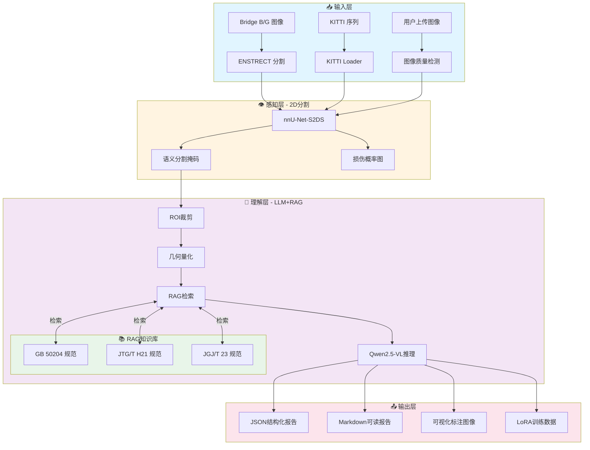
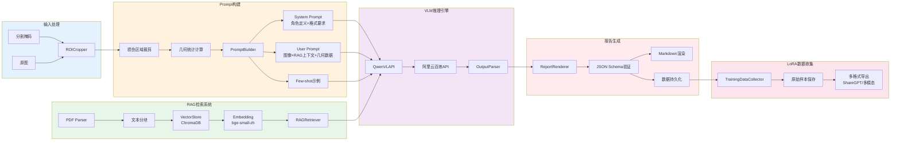
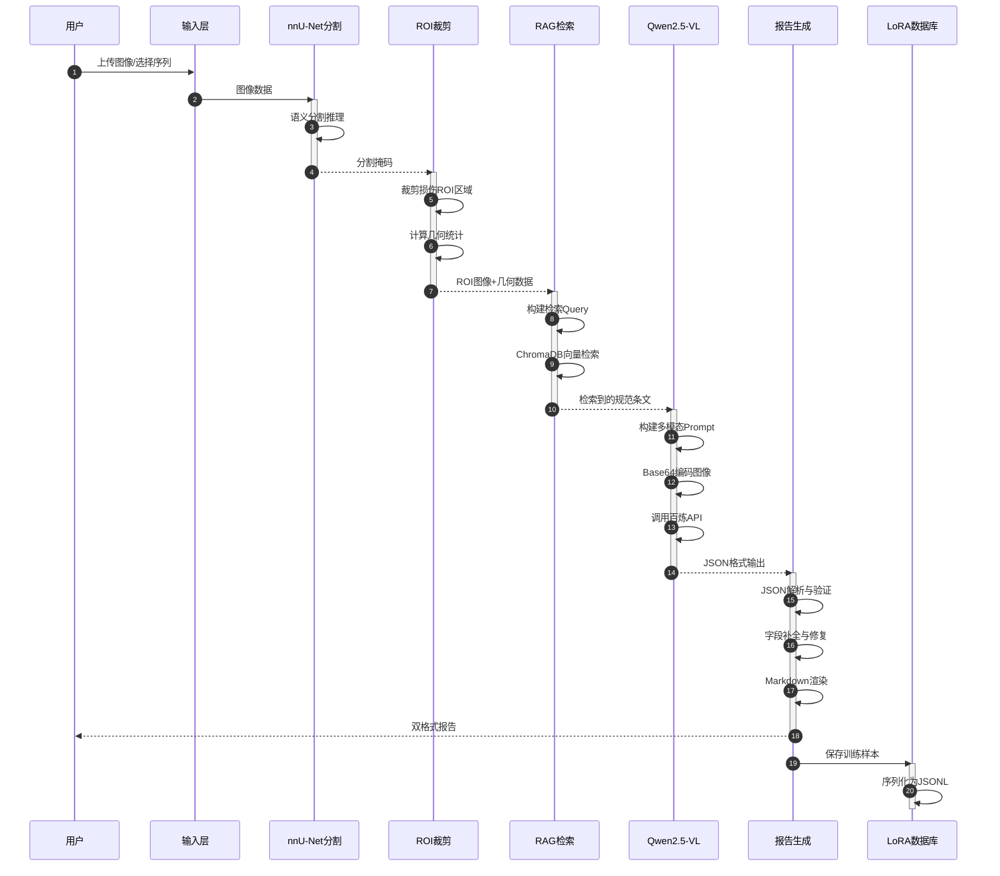
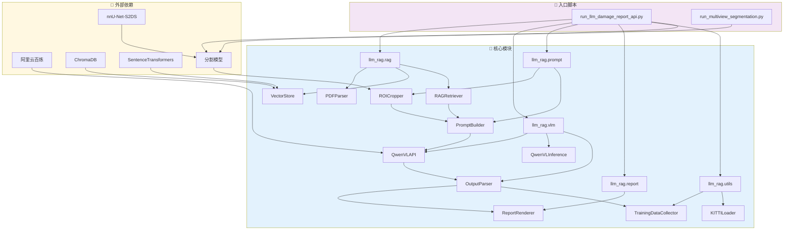
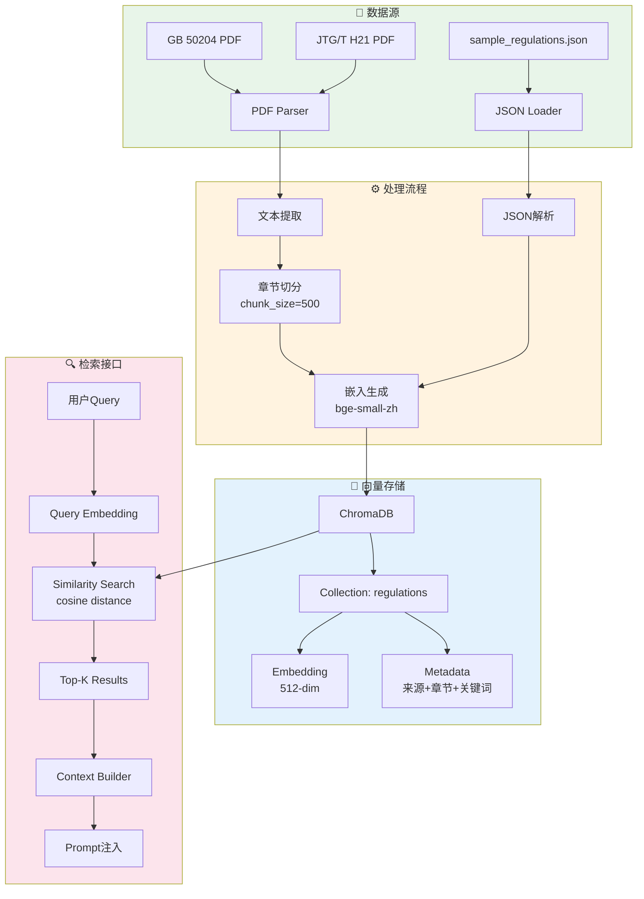
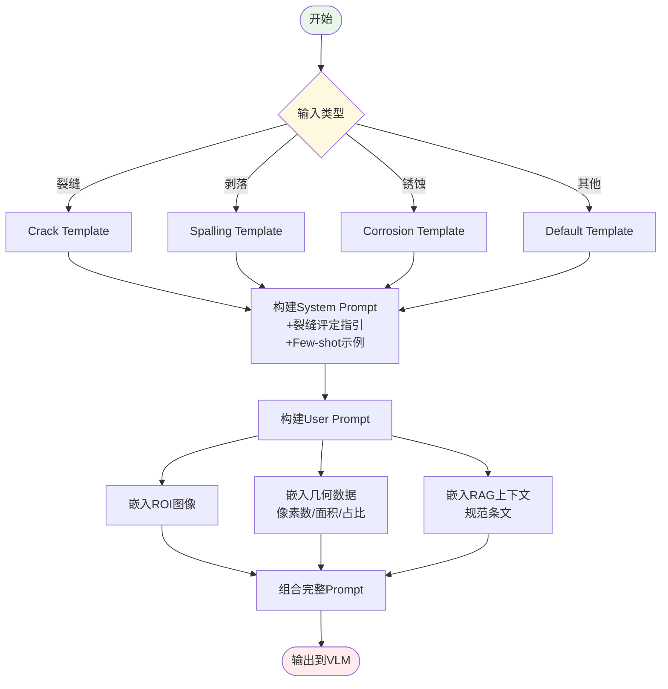
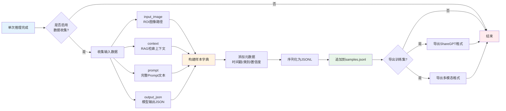
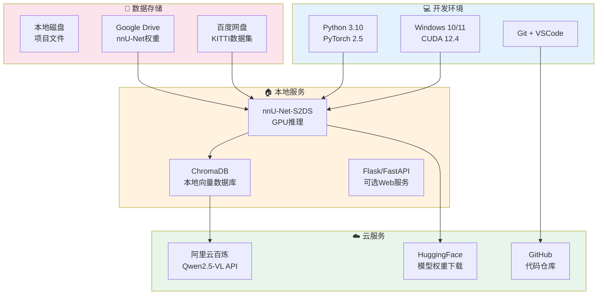
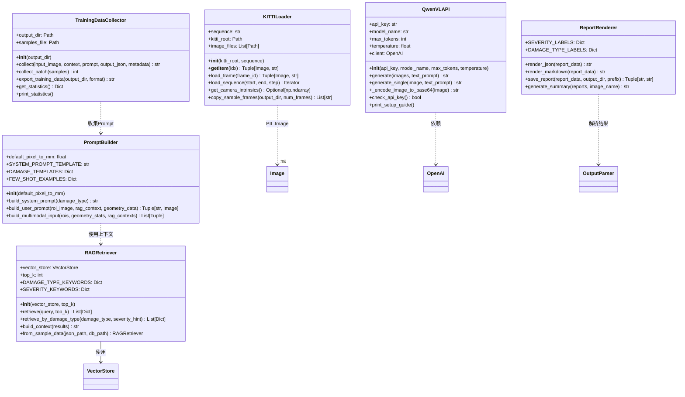

# ENSTRECT + LLM+RAG 系统架构图

> 本项目架构文档，使用 Mermaid 语法绘制系统流程与模块关系

---

## 1. 整体系统架构

---

## 2. LLM+RAG 模块详细架构

---

## 3. 数据流图

---

## 4. 模块依赖关系

---

## 5. RAG 知识库架构

---

## 6. Prompt 构建流程

---

## 7. LoRA 训练数据收集流程

---

## 8. 部署架构

---

## 9. 类图

---

## 10. 使用场景图

```mermaid
graph TB
    subgraph 场景1["场景1：单张图像检测"]
        A1[上传桥梁照片] --> B1[自动分割] --> C1[LLM分析] --> D1[生成报告]
    end

    subgraph 场景2["场景2：批量处理"]
        A2[选择图像目录] --> B2[批量分割] --> C2[并行LLM推理] --> D2[汇总报告]
    end

    subgraph 场景3["场景3：KITTI序列"]
        A3[选择KITTI序列] --> B3[序列加载] --> C3[逐帧处理] --> D3[时序分析]
    end

    subgraph 场景4["场景4：LoRA微调"]
        A4[收集推理数据] --> B4[样本标注] --> C4[格式转换] --> D4[模型微调]
    end

    style 场景1 fill:#e3f2fd
    style 场景2 fill:#fff3e0
    style 场景3 fill:#e8f5e9
    style 场景4 fill:#fce4ec
```

---

## 附录：图例说明

| 颜色 | 含义 |
|------|------|
| 🟦 浅蓝色 | 输入/数据层 |
| 🟨 浅黄色 | 处理/逻辑层 |
| 🟩 浅绿色 | 存储/知识库 |
| 🟪 浅紫色 | 推理/AI层 |
| 🟥 浅粉色 | 输出/结果层 |

---

> 📅 生成日期：2026-04-21
> 📝 使用 [Mermaid](https://mermaid.js.org/) 语法绘制
> 💡 可在支持 Mermaid 的 Markdown 渲染器中查看（如 GitHub、VSCode、Typora）
